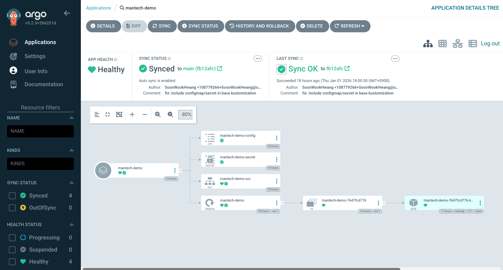

# mantech-gitops-manifests

Jenkins 파이프라인에서 빌드된 Docker 이미지 태그를 GitOps 저장소에 반영하고,  
Argo CD가 Kustomize로 매니페스트를 생성하여 Kubernetes(Docker Desktop) 클러스터에 배포하는 실습 레포입니다.

## 목표 아키텍처 (Local)

- **Jenkins**: 애플리케이션 빌드/테스트 → Docker 이미지 빌드 → Docker Hub Push → GitOps 매니페스트(image tag) 업데이트
- **Argo CD**: GitOps 레포 Watch → `kustomize build` → Kubernetes 반영(Sync)

---

## 디렉토리 구조

```bash
k8s/
  base/
    deployment.yaml
    service.yaml
    configmap.yaml
    secret.yaml
    kustomization.yaml
  overlays/
    local/
      kustomization.yaml
```

### `k8s/base`

공통 리소스(Deployment/Service/ConfigMap/Secret 등)를 정의합니다.

**중요 포인트**  
Argo CD/Kustomize는 overlay에서 base를 참조할 때 **파일 경로(`.../deployment.yaml`)가 아니라 디렉토리(`.../base`) 단위**로 누적(accumulate)하는 구성이 안정적입니다.  
따라서 `k8s/base/kustomization.yaml`을 만들고, base는 **디렉토리로 참조**하도록 구성합니다.

예) `k8s/base/kustomization.yaml`

```yaml
apiVersion: kustomize.config.k8s.io/v1beta1
kind: Kustomization
resources:
  - deployment.yaml
  - service.yaml
  - configmap.yaml
  - secret.yaml
```

### `k8s/overlays/local`

로컬(docker-desktop) 환경에 맞게 base를 가져와서 이미지 태그, replica, 환경변수 등을 오버라이드합니다.

예) `k8s/overlays/local/kustomization.yaml`

```yaml
apiVersion: kustomize.config.k8s.io/v1beta1
kind: Kustomization

namespace: mantech

resources:
  - ../../base

images:
  - name: boogi0501/mantech-demo
    newTag: latest
```

---

## Docker Desktop Kubernetes + Argo CD 설치

### 1) Kubernetes 컨텍스트 확인

```bash
kubectl config current-context
kubectl get nodes
```

### 2) 네임스페이스 생성

```bash
kubectl create namespace argocd
kubectl create namespace mantech
```

### 3) Argo CD 설치(Helm)

```bash
helm repo add argo https://argoproj.github.io/argo-helm
helm repo update
helm install argocd argo/argo-cd -n argocd
kubectl get pods -n argocd
```

### 4) Argo CD UI 접속

```bash
kubectl port-forward service/argocd-server -n argocd 8080:443
```

### 5) 초기 admin 비밀번호 확인

```bash
kubectl -n argocd get secret argocd-initial-admin-secret   -o jsonpath="{.data.password}" | base64 -d
```

---

## Argo CD Application 생성 가이드

Argo CD UI에서 Application 생성 시 아래 값을 사용합니다.

- **Source Repo URL**: `https://github.com/mantech-portfolio/mantech-gitops-manifests.git`
- **Path**: `k8s/overlays/local`
- **Destination**
  - Cluster: `https://kubernetes.default.svc`
  - Namespace: `mantech`
- **Sync Policy**: 자동(Automated) 선택 가능
  - `prune: true`, `selfHeal: true` 사용 가능
  - `syncOptions: - CreateNamespace=true` 사용 가능

---

## 에러 & 해결

### 1) `must build at directory ... file is not directory`

**증상**

- Argo CD에서 Application 생성/Sync 시 `kustomize build ... failed`
- `k8s/base/deployment.yaml: file is not directory` 류 에러

**원인**

- overlay의 `kustomization.yaml`에서 base를 파일로 직접 참조하거나  
  Argo CD 캐시 경로 기준 보안 제한(overlay 하위만 허용)에 걸리는 형태로 참조할 때 발생

**해결**

- `k8s/base/kustomization.yaml` 생성 (base를 디렉토리로 구성)
- overlay에서는 `resources: - ../../base`로 디렉토리 참조

---

### 2) `configmap "mantech-demo-config" not found`

**증상**

- Pod 이벤트/로그에 ConfigMap이 없다고 나오며 컨테이너가 실행되지 않음

**원인**

- Deployment가 `envFrom/configMapRef` 또는 volume으로 ConfigMap을 요구하지만  
  Kustomize 결과에 ConfigMap 리소스가 포함되지 않았을 때 발생

**체크/해결**

- `k8s/base/kustomization.yaml`의 `resources:`에 `configmap.yaml`이 포함되어 있는지 확인
- overlay가 `resources: - ../../base`로 base 전체를 가져오는지 확인
- 리소스들이 동일한 namespace(`mantech`)로 생성되는지 확인

---

## Jenkins와의 연결(개요)

Jenkins 파이프라인은 Docker Hub에 이미지를 push한 뒤,  
GitOps 레포의 Deployment 이미지 태그를 갱신(commit/push)합니다.

Argo CD는 Git 변경을 감지하고 Sync하여 배포를 최신화합니다.



<center>
-sync 된 pod deployment 화면 캡처-
</center>
